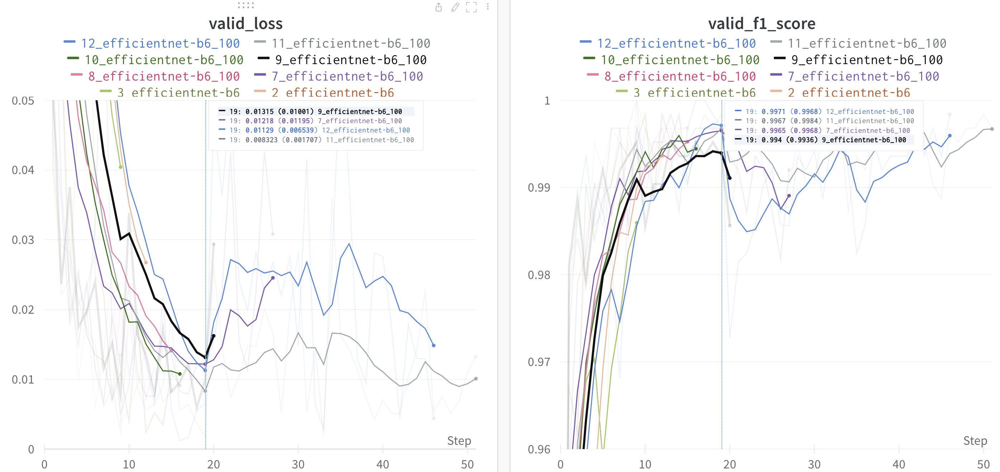

# Classifying the presence or absence of a disease using chest X-ray data

## Default
```bash
"Train"
$python main.py --action train --seed 0 --model efficientnet-b6 --epochs 100 --batchsize 16 --savepath savemodel

"TEST"
$python main.py --action test --seed 0 --model efficientnet-b6 --epochs 100 --batchsize 16 --savepath savemodel
```

## Experiments
|Model|CV|LB| EPOCHS | Transforms |
 |---|---|---|---|---|
|1_efficientnet-b6| 0.95 | 0.99038 |8|rm_vt_flip, rm_shap|
|2_efficientnet-b6| 0.95 |0.988806 |8|rm_vt_flip, rm_shap, seed = 1|
|3_efficientnet-b6| 0.95 |0.9968 |8|rm_vt_flip, rm_shap, seed = 2, epochs = 50|
|4_efficientnet-b6| 0.95 |0.993594 |8|rm_vt_flip, rm_shap, seed = 4, epochs = 50|

## Result



## Output
```
$scp psboys@202.30.30.19:/home/psboys/private/CT_Competition/submission/submit2.csv ~/Downloads
```